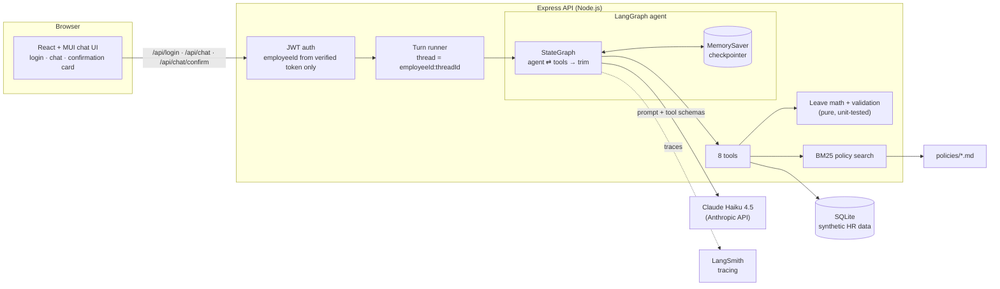
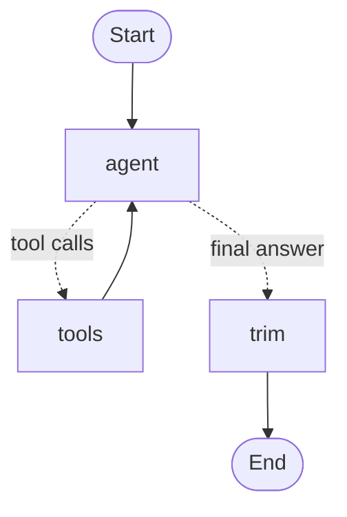
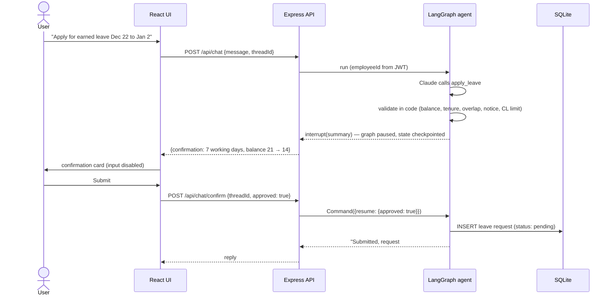

# HR Assist — an agentic HR chat assistant

HR Assist answers employees' leave and HR-policy questions and files leave requests for them. It is a
**LangGraph.js agent** running on **Claude Haiku 4.5**. The agent looks up the employee's own records,
searches the policy documents (citing them), does leave arithmetic in deterministic code, and asks the
user to confirm before it writes anything.

> All data in this project is **synthetic**: fictional company (Acme Corp), fictional employees, sample
> policies. No real HR or personal data is used.

**Stack:** TypeScript end to end · LangGraph.js · LangChain (Anthropic) · Express · SQLite (better-sqlite3) ·
React 19 + MUI · Vite · LangSmith tracing

---

## What it can do

| Ask | What the agent does |
|---|---|
| "What's my leave balance?" | One tool call → balances per leave type |
| "Can I take Dec 22 to Jan 2 off?" | Resolves the year, counts **working days** (skips weekends and the office's holidays), checks the balance and the leave type's policy rules, reports loss of pay if any |
| "How many earned leave days can I carry forward?" | Searches the policy documents and answers with a citation, e.g. *(Leave Policy §4)* |
| "What is the bereavement leave policy?" | Says the policy documents don't cover it instead of guessing |
| "What about sick leave instead?" | Uses conversation memory for the follow-up |
| "Apply for earned leave from Dec 22 to Jan 2" | Validates the request in code, **pauses for confirmation**, writes it only after the user clicks Submit |
| "What is Dev Patel's leave balance?" | Refuses: users can only see their own data |

---

## Quick start

**Prerequisites:** Node.js 22.12 or newer (developed on Node 25), an [Anthropic API key](https://console.anthropic.com).

```bash
npm run setup                          # installs root, server and client dependencies; seeds the database
cp server/.env.example server/.env     # Windows: copy server\.env.example server\.env
```

Edit `server/.env`:

| Variable | Required | Notes |
|---|---|---|
| `ANTHROPIC_API_KEY` | yes | Claude key |
| `JWT_SECRET` | yes | 32+ random characters: `node -e "console.log(require('crypto').randomBytes(32).toString('hex'))"` |
| `LLM_PROVIDER` / `LLM_MODEL` | no | Defaults to `anthropic` / `claude-haiku-4-5`. `google` + `GOOGLE_API_KEY` switches to Gemini |
| `LANGSMITH_TRACING`, `LANGSMITH_API_KEY`, `LANGSMITH_PROJECT` | no | Turns on LangSmith traces of every model and tool call |
| `APP_TODAY` | no | Pin "today" (YYYY-MM-DD) for reproducible demos |

```bash
npm run dev          # API on :3001 and UI on :5173 together
```

Open http://localhost:5173 and pick a demo account (password for all: `Password@123`):

| Account | Why it's interesting |
|---|---|
| `asha.rao@example.com` | Main demo user (Chennai): leave history, a pending request |
| `dev.patel@example.com` | Bengaluru office: different regional holidays |
| `priya.nair@example.com` | Joined Jul 2026: pro-rated quota, not yet eligible for earned leave |
| `ravi.kumar@example.com` | Manager of the others |

Other scripts (from the project root): `npm test` (server tests), `npm run typecheck`, `npm run db:reset`
(restore the demo data). In `server/`: `npm run chat` (terminal chat; `-- --as E1003` to switch user),
`npm run graph` (print the agent graph as Mermaid).

---

## Architecture



### The agent graph



- **agent**: calls Claude with a short system prompt (added per call, not stored) and the conversation.
- **tools**: LangGraph's `ToolNode` runs every tool the model asked for, in parallel, and returns errors to the
  model as messages so it can correct itself (e.g. a bad date).
- **trim**: once a turn is answered, removes its tool calls/results and keeps only the last 4 question/answer
  pairs. Saves tokens on every later turn.
- **State** = `messages` + `employeeId`. The checkpointer saves state after every step under the thread ID: that is
  the conversation memory, and it is what lets a run pause and resume.

### Tools

| Tool | Purpose |
|---|---|
| `get_employee_profile` | Grade, department, location, joining date, tenure, manager |
| `get_leave_balance` | Allocated, carried forward, used, pending, available per leave type |
| `get_leave_history` | The user's requests in a date range |
| `get_holidays` | Holiday calendar for a year and office |
| `calculate_leave` | Working days in a range (weekends + office holidays excluded), loss of pay, balance after, pro-rata entitlement, encashment |
| `check_eligibility` | Tenure and balance check for a leave type |
| `search_policy` | Keyword search over the policy documents; returns sections with citation labels |
| `apply_leave` | Validates, asks the user to confirm (interrupt), then writes a pending request |

No tool takes an employee ID. Every tool reads the identity from graph state, which only the server sets.

### Applying for leave (human in the loop)



If the user cancels, nothing is written. If the request breaks a rule, the agent explains the problem and
never shows a confirmation.

---

## Design decisions

**Math and rules live in code, not in the LLM.** Working days, balances, loss of pay, pro-rata and encashment are
pure functions with unit tests. The model only chooses tools, fills arguments and explains results; the prompt tells
it not to do arithmetic (not even totals).

**Identity can't be talked around.** `employeeId` flows *verified JWT → request → graph state → tools*. Nothing the
user types or sends in the request body can change it; requests for other employees are refused. Conversation
threads are keyed `employeeId:threadId`, so a guessed thread ID can't load someone else's chat.

**Writes are validated, then confirmed.** `apply_leave` checks every hard rule in code (balance, 6-month tenure for
earned leave, overlapping requests, no past dates, casual leave ≤ 3 consecutive days, 7 days' notice for 3+ days of
earned leave) *before* asking. The LangGraph interrupt pauses the graph; on resume the tool re-runs from the top, so
everything before the interrupt is side-effect free and the database write comes last.

**Grounded policy answers.** Policies are split into short `##` sections and indexed with BM25 at startup. Results
must match at least one distinctive word, so a question about an uncovered topic returns nothing and the agent says
the policy doesn't cover it. Answers cite the source section.

**Keyword search instead of embeddings.** Anthropic has no embeddings API, and the policy set is small and well
structured. Local BM25 needs no second provider, no API calls and no tokens, and it is deterministic and testable.
A small synonym map (vacation → earned leave, WFH → work from home, ...) covers common paraphrases.

**Token budget as a design constraint.** The project ran on $5 of Claude credit, so every choice was made for low
token use:

| Lever | Choice |
|---|---|
| Model | Claude Haiku 4.5 (cheapest Claude), swappable via `LLM_PROVIDER` / `LLM_MODEL` |
| Prompt + tool schemas | Terse; ~1.2k tokens per call for 8 tools |
| Tool results | Compact JSON, no echoed inputs, empty fields omitted |
| History | Tool traffic removed after each turn; last 4 Q&A pairs kept |
| Answers | "Under 80 words, table only for 3+ rows" — output tokens cost 5× input |
| Redundant calls | Prompt and tool descriptions steer to the minimal tool set |
| Retrieval | Local BM25: zero tokens to search, ≤ 3 short sections returned |

Measured examples: a refusal costs 1 model call (~1.7k input tokens); "what's my balance" 2 calls (~3.6k in /
~115 out); a full leave application ~4.2k in / ~230 out — roughly half a US cent per question.

**Provider-agnostic.** The app only sees LangChain's `BaseChatModel`. Switching to Gemini is a `.env` change;
another provider is one `case` in `server/src/llm.ts`. Gemini's free-tier rate limit (5 requests/minute) needed a
custom retry handler that honours the server's `retryDelay`; it is included and tested.

---

## Security and data

- Synthetic data only; passwords are bcrypt hashes; the seed prints the demo password.
- JWT (HS256, 8h, `algorithms` pinned so `alg: none` is rejected). Wrong password and unknown email return the same
  message and take the same time.
- API returns only public employee fields; malformed or oversized requests are rejected (1000-char messages, 10 kB
  bodies); server errors are generic to the client.
- The UI keeps the token in memory only (no localStorage).
- Secrets live in `server/.env` (gitignored); `.env.example` has placeholders.

---

## Testing

```bash
npm test     # 36 tests, no LLM calls, no API cost
```

| Area | What is covered |
|---|---|
| Leave math | Working days across Christmas/New Year, tenure, pro-rata, encashment, loss of pay, invalid dates |
| Leave validation | Every apply_leave rule, on a fresh temporary database |
| Policy search | Section parsing, stemming, correct top section for 6 questions, "not covered" cases |
| Agent graph | The real graph with a **scripted fake model** and a temp database: pause → confirm → write, cancel, rule violations, per-employee threads, history cap |
| API + auth | Login, forged/expired/`alg:none`/unknown-user tokens, body `employeeId` ignored, thread IDs, confirm endpoint (409 when nothing is pending) |
| Retry handler | Gemini per-minute vs daily quota errors |

LangSmith traces (`LANGSMITH_TRACING=true`) show each turn's agent → tools → agent → trim steps, the exact
prompts, tool inputs/outputs and token counts.

---

## Project structure

```
├── package.json            # root scripts: setup, dev (API + UI), test, typecheck, db:reset
├── server/
│   ├── policies/           # synthetic policy documents (Leave, Holiday, Attendance/WFH)
│   └── src/
│       ├── agent/          # graph.ts (StateGraph), state.ts, prompt.ts, run.ts (turn runner)
│       ├── tools/          # the 8 LLM tools
│       ├── hr/             # leaveMath.ts (pure), leaveRequest.ts (validation), repo.ts (SQL), dates.ts
│       ├── rag/            # policyIndex.ts (BM25)
│       ├── auth/           # login, JWT sign/verify
│       ├── server/         # Express app + entry point
│       ├── db/             # schema, seed, temp-DB helper for tests
│       ├── llm.ts          # model factory (provider switch, Gemini retry handler)
│       ├── config.ts       # all settings
│       └── cli.ts          # terminal chat for development
├── client/src/             # React + MUI: LoginPage, ChatPage, ConfirmLeaveCard, api.ts
└── docs/PROGRESS.md        # stage-by-stage build log and decision record
```

---

## Limitations and future enhancements

- **Persistent memory:** conversations use an in-memory checkpointer and reset when the server restarts. A
  SQLite/Postgres checkpointer would persist them (the SQLite package currently pins an older better-sqlite3).
- **Manager role:** team leave calendar and approve/reject from the chat (Ravi is already modelled as a manager).
- **Semantic retrieval:** embeddings or hybrid search once the policy set grows beyond keyword search's reach.
- **Streaming replies** token by token to the UI.
- **Sessions:** httpOnly cookie + refresh tokens instead of an in-memory bearer token; login rate limiting.
- **Leave edge cases:** half-day leave, cancelling requests from chat, year-boundary balances (a Dec–Jan request is
  currently checked against the current year's balance).
- **Prompt caching** once the cached prefix reaches Haiku 4.5's 4,096-token minimum (or on a model with a lower
  minimum).
- **Evaluation set:** a scripted set of questions with expected tool calls and answers, run in CI with a small budget.
