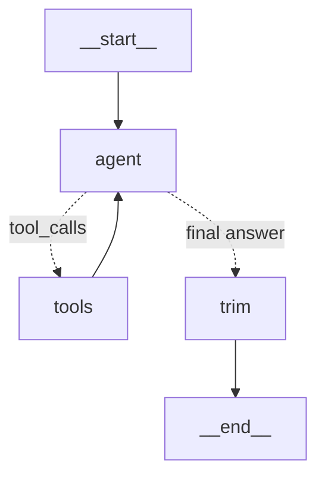

# Build Log — HR Chat Agent

Running log of every stage: what was built, why, how to run it, and what's next.
Read this together with [CLAUDE.md](../CLAUDE.md) (goals, stack, rules, plan) to pick up
work without missing context. Update it at the end of every stage.

---

## Current status

| Stage | Description | Status |
|---|---|---|
| 1 | Project setup, SQLite schema + synthetic seed, bare Gemini CLI chat | ✅ Done — user-tested (chat, memory, LangSmith traces) |
| 2 | HR tools + tool calling (+ switch to Claude Haiku 4.5, token diet) | ✅ Done — user-tested |
| 3 | LangGraph agent wiring all tools | ✅ Done — user-tested, all cases |
| 4 | `search_policy` RAG over policy docs (local BM25 keyword search) | ✅ Done — user-tested, all 5 cases (incl. policy + data milestone) |
| 5 | Login + JWT, employee_id injected into state | Not started |
| 6 | Conversation memory (checkpointer) + `apply_leave` interrupt | Not started |
| 7 | React + MUI chat UI | Not started |
| 8 | LangSmith tracing, README + Mermaid diagram, demo, push, submit | Tracing wired in Stage 1 (env-only); rest not started |

**Next action:** Stage 5 — Express API + JWT login (bcrypt against seeded users), employeeId from the verified token into graph state.

**Commits:** `6d4384a` Stage 1 · `816929d` Stage 2 · `a0af586` Stage 3.

---

## Environment

- Windows 11, PowerShell. Node **v25.9.0** (Current, not LTS), npm 11.12.1.
- `better-sqlite3` verified working on Node 25 (prebuilt binary, no compiler needed).
- Git repo at project root. Git identity in this repo (confirmed by user):
  `muthukumar.ramasamy@ideas2it.com`.
- **Budget: only $5 of Claude API credit for the whole project** (user, 2026-10-03). Haiku 4.5 = $1/M input,
  $5/M output; a typical turn (~3.5k in / ~200 out) ≈ $0.005 → roughly 1,000 turns. Assistant does not run live
  Claude calls; prefer no-LLM checks. If credit runs low, switch to `LLM_PROVIDER=google` (free tier).
- **LLM: Claude Haiku 4.5 (`claude-haiku-4-5`) via `@langchain/anthropic`** — switched from Gemini on
  2026-10-03 at user request ("use the model that uses the fewest tokens"). Needs `ANTHROPIC_API_KEY` in
  `server/.env`. Gemini remains available with `LLM_PROVIDER=google` (free tier: only 5 requests/minute).

## Repository layout

```
HR bot/
├── CLAUDE.md              # project brief (goals, stack, rules, plan)
├── .gitignore             # ignores node_modules, .env*, *.db (keeps .env.example)
├── docs/
│   └── PROGRESS.md        # this file
└── server/                # Node/TypeScript backend + agent
    ├── package.json       # "type": "module"; scripts below
    ├── tsconfig.json      # strict, noEmit, moduleResolution "bundler" (extensionless imports)
    ├── .env.example       # placeholders only; real keys go in server/.env
    ├── data/hr.db         # generated SQLite file (gitignored)
    ├── policies/          # synthetic HR policy docs (markdown, '## N. Title' sections)
    │   ├── leave-policy.md        # 10 sections
    │   ├── holiday-policy.md      # 4 sections
    │   └── attendance-policy.md   # 4 sections
    └── src/
        ├── config.ts      # all runtime settings in one place
        ├── llm.ts         # createChatModel() — the ONLY place the provider is chosen (anthropic | google); Gemini retry handler
        ├── llm.test.ts    # retry handler tests (simulated Gemini errors)
        ├── cli.ts         # chat loop; Stage 2 = hand-written tool-calling loop
        ├── agent/
        │   ├── prompt.ts  # buildSystemPrompt() — today's date + rules
        │   ├── state.ts   # AgentState: messages + employeeId (Annotation)
        │   └── graph.ts   # buildAgentGraph(): agent -> tools -> agent ... -> trim -> END
        ├── tools/
        │   └── index.ts   # the 7 HR tools (hrTools array), incl. search_policy
        ├── rag/
        │   ├── policyIndex.ts       # parsePolicy, tokenize/stem, BM25 PolicyIndex, getPolicyIndex()
        │   └── policyIndex.test.ts
        ├── hr/
        │   ├── dates.ts         # ISO date helpers (UTC), today() (APP_TODAY override)
        │   ├── leaveMath.ts     # pure deterministic calculations
        │   ├── leaveMath.test.ts
        │   └── repo.ts          # read-only SQL queries
        └── db/
            ├── schema.ts  # CREATE TABLE statements
            ├── index.ts   # getDb() singleton (WAL, foreign keys, applies schema)
            └── seed.ts    # synthetic demo data
```

## Scripts (run inside `server/`)

| Command | What it does |
|---|---|
| `npm run db:seed` | Creates `data/hr.db` and seeds it — only if empty (safe to re-run) |
| `npm run db:reset` | Clears the demo tables and reseeds |
| `npm run chat` | CLI chat as E1001 (Asha). `npm run chat -- --as E1003` to be another seeded employee |
| `npm run graph` | Print the agent graph as a Mermaid diagram (for README) |
| `npm run typecheck` | `tsc --noEmit` |
| `npm test` | Unit tests (`node:test` via tsx): leave math, retry handler, policy retrieval (17). No API calls |

Code runs with `tsx` (TypeScript executed directly, no build step).

## Installed packages

| Package | Version | Purpose |
|---|---|---|
| @langchain/core | 1.2.x | Messages, chat model interface, tools |
| @langchain/anthropic | 1.5.x | Claude chat model (default provider) |
| @langchain/google-genai | 2.3.x | Gemini chat model + embeddings |
| @langchain/langgraph | 1.4.x | Agent graph, checkpointer, interrupts (used from Stage 3) |
| better-sqlite3 | 13.x | SQLite (synchronous API) |
| bcryptjs | 3.x | Password hashing (pure JS — no native build; same bcrypt format) |
| dotenv | 18.x | Loads `server/.env` (`quiet: true` to suppress its log line) |
| zod | 4.x | Tool input schemas (from Stage 2) |
| typescript (dev) | 7.x | Typecheck only |
| tsx (dev) | 4.x | Run TS directly |

---

## Stage 1 — Project setup, database, bare chat loop

### What was built

**Config ([server/src/config.ts](../server/src/config.ts))**
- `config.dbPath` (default `./data/hr.db`), `config.llm.{provider, model, temperature: 0, maxRetries: 6, apiKey()}`.
- `apiKey()` is a function so it's only required when the LLM is actually used —
  `db:seed` works without a key. It throws a clear error if the key is missing or still
  the `your-...` placeholder.

**Model factory ([server/src/llm.ts](../server/src/llm.ts))**
- `createChatModel(): BaseChatModel` — switch on `LLM_PROVIDER`; only `"google"` today.
- Rest of the app depends only on `BaseChatModel`, so moving to Claude/OpenAI = add one
  `case` + install the provider package + change `.env`. (Satisfies "provider swappable in one place".)
- Rate limits: `maxRetries: 6` uses LangChain's built-in retry with exponential backoff.
  **Superseded in Stage 2** — see the Gemini retry handler below (LangChain's default gave up on Gemini 429s).

**Database schema ([server/src/db/schema.ts](../server/src/db/schema.ts))**

| Table | Key columns | Notes |
|---|---|---|
| `employees` | id (`E1000`…), name, email, password_hash, role (`employee`/`manager`), grade, department, location, joining_date, manager_id | Location drives the holiday calendar |
| `leave_types` | code (`CL`/`SL`/`EL`), annual_quota, min_tenure_months, max_carry_forward, encashable | Machine-readable rules for deterministic code (eligibility/calculations). Policy docs (Stage 4) must describe the same rules in prose |
| `leave_allocations` | (employee_id, leave_type, year) PK, allocated, carried_forward | Days granted. **Used/pending are NOT stored** |
| `leave_requests` | id, employee_id, leave_type, start/end date, days, reason, status (`pending`/`approved`/`rejected`/`cancelled`), applied_on | `days` = working days, computed in code |
| `holidays` | date, name, location (`ALL` or a city) | UNIQUE(date, location) |

Design decision: **available balance = allocated + carried_forward − approved days − pending days**,
derived from `leave_requests` at query time so numbers can never drift.

**Seed data ([server/src/db/seed.ts](../server/src/db/seed.ts)) — all fictional**

Leave rules:

| Code | Name | Quota/yr | Min tenure | Max carry-forward | Encashable |
|---|---|---|---|---|---|
| CL | Casual Leave | 12 | 0 | 0 | No |
| SL | Sick Leave | 12 | 0 | 6 | No |
| EL | Earned Leave | 18 | 6 months | 30 | Yes |

Users (password for all: `Password@123`):

| ID | Name | Email | Role | Grade | Location | Joined | Purpose in demo |
|---|---|---|---|---|---|---|---|
| E1000 | Ravi Kumar | ravi.kumar@example.com | manager | G7 | Chennai | 2017-03-01 | Manager of all others (stretch goal) |
| E1001 | Asha Rao | asha.rao@example.com | employee | G5 | Chennai | 2021-06-14 | **Main demo user**; has history + a pending request |
| E1002 | Dev Patel | dev.patel@example.com | employee | G4 | Bengaluru | 2023-01-09 | Different location → different holidays |
| E1003 | Priya Nair | priya.nair@example.com | employee | G3 | Bengaluru | 2026-07-01 | New joiner: pro-rated quota (6 CL/6 SL), **not EL-eligible** until 6 months |

Asha's (E1001) 2026 balances after seeding:

| Type | Allocated + CF | Approved used | Pending | Available |
|---|---|---|---|---|
| CL | 12 | 1 | 1 (Oct 16) | 10 |
| SL | 12 + 4 = 16 | 2 | 0 | 14 |
| EL | 18 + 8 = 26 | 5 | 0 | 21 |

Holidays: 2026 and 2027, national (`ALL`) + Chennai (Pongal) + Bengaluru (Karnataka Rajyotsava).
Dec 25 2026 and Jan 1 2027 are both Fridays — useful for demo question "Dec 22 – Jan 2".

Seeding behaviour: skips if employees exist; `--reset` deletes child tables first (FK order)
then reseeds, inside one transaction.

**CLI ([server/src/cli.ts](../server/src/cli.ts))**
- readline loop: `you>` / `bot>`; `exit` or `quit` to leave.
- Uses `for await (const line of rl)` rather than `rl.question()`: `question()` dropped lines
  typed while the bot was still replying (found in user testing); the async iterator buffers them.
- Keeps `messages: BaseMessage[]` starting with a `SystemMessage`; appends each
  `HumanMessage` and `AIMessage`. On error, removes the unanswered question.
- System prompt says it has no HR data yet (tools come in Stage 2).

**LangSmith tracing (pulled forward from Stage 8)**
- Enabled purely via env vars in `server/.env`: `LANGSMITH_TRACING=true`, `LANGSMITH_API_KEY`,
  `LANGSMITH_PROJECT=hr-agent`. LangChain auto-traces every model call (and later tool calls /
  graph steps) — no code wiring needed. `langsmith` client ships with `@langchain/core`.
- `config.tracing` exists only to show "LangSmith tracing: ON/off" in the CLI banner.
- CLI calls `awaitAllCallbacks()` on exit so background trace uploads finish before the process ends.
- View traces at https://smith.langchain.com → Projects → `hr-agent`. Each trace shows the full
  messages sent (incl. system prompt), the reply, tokens and latency.

### Concepts introduced

- **The LLM is stateless.** Each call sends the full conversation; "memory" is just the
  messages array we resend. Stage 6 replaces this with a LangGraph checkpointer keyed by `thread_id`.
- **Message roles.** `SystemMessage` = instructions/rules (later: cite sources, refuse other
  employees' data, say "not covered" instead of guessing). `HumanMessage` = user. `AIMessage` = model.
- **Temperature 0** for consistent, factual answers.

### Verified

- `npm run typecheck` passes.
- `npm run db:seed` seeds correctly; second run skips. Counts: 4 employees, 3 leave types,
  12 allocations, 8 requests, 18 holidays.
- Every seeded request's `days` matches its weekday count.
- `npm run chat` without a key → `Missing env var GOOGLE_API_KEY…`, exit code 1.
- User verified a real Gemini call with `gemini-3.8-flash` (2026-10-03): greeting works and the
  system prompt is followed (bot says it has no HR data yet).

### How to test

```powershell
cd server
copy .env.example .env     # paste key from https://aistudio.google.com/apikey
npm run chat
```
Try: "Hi, what can you help with?" → "My name is Asha" → "What's my name?" (history works)
→ "What's my leave balance?" (should say it can't look that up yet).
Model: `gemini-3.8-flash`. (`gemini-2.5-flash` returned 404 "no longer available to new
users" on 2026-10-03.) If a model is retired, change `LLM_MODEL` in `.env` — no code change.

---

## Stage 2 — HR tools + tool calling

### What was built

**Layering** (each layer only talks to the one below):
`cli.ts` (loop) → `tools/index.ts` (LLM-facing) → `hr/repo.ts` (SQL) + `hr/leaveMath.ts` (pure math) → SQLite.

**Deterministic math ([server/src/hr/leaveMath.ts](../server/src/hr/leaveMath.ts))** — no DB, no LLM:

| Function | Rule |
|---|---|
| `countWorkingDays(start, end, holidays)` | Inclusive range; skips Sat/Sun and weekday holidays; returns calendar/weekend/holiday/working counts + holiday list |
| `tenureMonths(joining, asOf)` | Whole months completed |
| `eligibleFrom(joining, minMonths)` | Joining date + N months, clamped to month end |
| `proRataEntitlement(quota, joining, year)` | Joiners: quota × remaining months / 12; joining month counts if joined on/before the 15th; round to 0.5. Earlier joiners: full quota |
| `encashableDays(available, encashable)` | min(available, **15**) if encashable, else 0 (`ENCASHMENT_MAX_DAYS_PER_YEAR`) |
| `lossOfPayDays(requested, available)` | requested − max(available, 0), floored at 0 |

**Dates ([server/src/hr/dates.ts](../server/src/hr/dates.ts))**: all ISO `YYYY-MM-DD` in UTC; strict
validation (rejects `2026-02-30`). `today()` returns `APP_TODAY` from `.env` if set (for reproducible
demos), else the real local date.

**Queries ([server/src/hr/repo.ts](../server/src/hr/repo.ts))**: `getEmployee`, `getLeaveType`,
`getLeaveBalances(id, year, type?)` (computes used/pending/available in SQL; requests count toward
the year they *start* in), `getLeaveRequests(id, from, to)` (overlap), `getHolidays(location, from, to)`
(location + `ALL`), `listLocations`.

**Tools ([server/src/tools/index.ts](../server/src/tools/index.ts))** — exported as `hrTools`:

| Tool | Input (zod) | Returns |
|---|---|---|
| `get_employee_profile` | none | profile, tenure, manager name |
| `get_leave_balance` | `leave_type?` | current-year balances + `total_available` |
| `get_leave_history` | `from_date?`, `to_date?` (default current year) | requests overlapping range |
| `get_holidays` | `year`, `location?` (default own) | holidays; unknown location → error listing known ones |
| `calculate_leave` | `calculation` = `leave_days` \| `pro_rata_entitlement` \| `encashment`, `leave_type?`, `start_date?`, `end_date?` | `leave_days`: working days, holidays hit, overlapping approved/pending requests; with `leave_type` also available, covered, **loss_of_pay_days** (+ note if range spans two years — checked against current-year balance) |
| `check_eligibility` | `leave_type` | eligible, reasons (tenure with eligible-from date; zero balance), tenure, balance |

Not yet built (later stages): `search_policy` (Stage 4), `apply_leave` (Stage 6).

**Identity rule**: no tool has an employee-ID parameter. Each tool reads
`config.configurable.employee_id` from the run config (`currentEmployee(config)`); missing → throws
"No authenticated employee in this session." The CLI sets it from `--as` (default `E1001`) as a
stand-in for login; Stage 5 sets it from the verified JWT.

**System prompt ([server/src/agent/prompt.ts](../server/src/agent/prompt.ts))**: includes today's
weekday + date; tools act on the logged-in employee; refuse other employees' data *directly without
tool calls*; use tools for every fact; never do date/leave arithmetic (not even totals); resolve
relative dates ("next week" = next Mon–Fri) and state them; CL/SL/EL meanings; policy docs not
connected yet.

**Tool-calling loop ([server/src/cli.ts](../server/src/cli.ts) `runTurn`)** — hand-written on purpose:
1. `model.bindTools(hrTools)` → model sees tool names/descriptions/JSON schemas.
2. Invoke model with full history. If the `AIMessage` has no `tool_calls` → final answer.
3. Else run each tool (`tool.invoke({...call, type: "tool_call"}, runConfig)` → `ToolMessage`
   linked by `tool_call_id`), append, loop. Tool errors become `ToolMessage(status: "error")` so the
   model can self-correct. Max 8 rounds.
4. The original `AIMessage` object is pushed back unchanged — **Gemini 3 needs its "thought
   signature" metadata on tool-call messages** returned in later requests.
5. On failure the whole turn is removed from history (`messages.splice(turnStart)`).
6. Tool calls/results are printed dimmed (`-> name(args)`, `<- result`).
- Readline fix: input closing mid-turn (piped input) no longer throws "readline was closed".

**Gemini retry handler ([server/src/llm.ts](../server/src/llm.ts) `geminiRetryHandler`)**
- Problem found in live testing: Gemini's per-minute 429 message says "exceeded your current quota…
  billing", which LangChain's default handler classifies as a *hard* quota error → no retry at all.
- Fix: pass `onFailedAttempt` to the model. LangChain's retry loop (p-retry) awaits it: return → retry,
  throw → stop. On 429 it reads Gemini's `errorDetails` (`RetryInfo.retryDelay`, quota IDs):
  per-day quota → stop with a clear message; delay ≤ 65s → print notice, sleep delay + 1s, retry;
  longer → stop. 400/401/403/404 → stop. Other errors (5xx/network) → retry with exponential backoff.

### Concepts introduced

- **Tool calling.** The model never runs code. It returns a structured request
  (`tool_calls: [{name, args, id}]`); *our* code executes it and sends back a `ToolMessage`. The
  model then continues with the result. Tool descriptions are effectively prompt text — they decide
  when the model picks a tool.
- **The agent loop.** Model → tools → model → … until a plain-text answer. That loop *is* an agent;
  Stage 3 moves it into a LangGraph graph (nodes: model, tools; conditional edge on `tool_calls`).
- **Parallel tool calls.** One model response can request several tools (seen live: `calculate_leave`
  + `check_eligibility` ×2 in one round).
- **Context outside the LLM.** `employee_id` travels in the run config, not the prompt, so a user
  can't talk the model into another identity.
- **Deterministic vs. generative.** Math and rules live in tested code; the LLM only picks tools,
  fills arguments and explains results.

### Verified

- `npm run typecheck` passes; `npm test` 10/10 (6 leave-math, 4 retry-handler with simulated errors).
- Every tool invoked directly (no LLM) against seed data — results match expectations, e.g.
  Asha Dec 22–Jan 2 = 12 calendar / 3 weekend / 2 holidays / **7 working days**; Oct 12–16 flags the
  pending Oct 16 request; Priya EL not eligible ("eligible from 2027-01-01"), pro-rata CL = 6;
  Asha EL encashable 15 of 21; no identity → throws; bad date → throws.
- Live Gemini run (as Asha, today 2026-10-03):
  - "What's my leave balance?" → single `get_leave_balance` call, correct table.
  - "Can I take 5 days off next week?" → resolved to Mon Oct 5–Fri Oct 9, called
    `calculate_leave` + `check_eligibility`(CL, EL) → correct "yes, 5 working days" answer.
  - "What is Dev Patel's leave balance?" → refused (before the prompt fix it made an unneeded
    `get_employee_profile` call; prompt now says refuse without tools — not re-verified live).
  - First run hit the 5 RPM limit and failed → led to the retry handler (live retry not yet observed).

### How to test

```powershell
cd server
npm test                       # no API calls
npm run chat                   # as Asha (E1001, Chennai)
```
Try:
1. "What's my leave balance?" → one tool call
2. "Can I take 5 days off next week?" → several tools, states the exact dates
3. "Can I take Dec 22 to Jan 2 off?" → 7 working days (Christmas + New Year excluded)
4. "What if I take sick leave instead?" → follow-up uses the same dates
5. "What is Dev Patel's leave balance?" → refusal, no tool call
6. "Am I eligible for earned leave?" as Priya: `npm run chat -- --as E1003` → not eligible until 2027-01-01

Expect occasional `[rate limited by Gemini, retrying in Ns]` — that's the 5 RPM free tier.

---

## Provider switch — Gemini → Claude Haiku 4.5 (during Stage 2)

- `config.ts`: `LlmProvider = "anthropic" | "google"`; default provider `anthropic`; per-provider default
  model (`claude-haiku-4-5` / `gemini-3.8-flash`) and API-key env var (`ANTHROPIC_API_KEY` / `GOOGLE_API_KEY`);
  empty `LLM_MODEL` → provider default; unknown provider → error at startup. New `maxTokens: 2048` reply cap.
- `llm.ts`: `ChatAnthropic({ model, temperature: 0, maxTokens, maxRetries: 6, apiKey })`. Claude 429s include a
  `retry-after` header and no "quota/billing" wording, so LangChain's default retry handles them; the custom
  `geminiRetryHandler` stays on the Gemini branch only. Out-of-credit errors are 400 → not retried.
- `cli.ts`: prints `[N model calls, tokens: X in / Y out]` after each answer (sums `usage_metadata` of the turn's
  AI messages). Input tokens grow per call because each call resends the full history + tool schemas.
- `.env.example` rewritten for both providers.
- No other code changed — tools, prompt and loop are provider-agnostic (proves the "swappable in one place" rule).
- **Prompt caching not used:** Haiku 4.5 only caches prefixes ≥ 4096 tokens; our system prompt + tool schemas are
  smaller, so caching would silently do nothing.
- First Claude run ("Dec 22 – Jan 2"): correct (7 working days, EL, no LOP), 2 model calls, 4965 in / 488 out tokens.
  Issues fixed: model made unneeded `get_employee_profile` + 2× `get_holidays` calls (prompt now says call only needed
  tools; `calculate_leave` description says holidays/location are already handled) and computed "14 remaining" itself
  (`calculate_leave` now returns `balance_after_leave`).

## Token diet (standing rule from 2026-10-03: "always use fewer tokens")

Rule added to CLAUDE.md "Key design rules" and saved to assistant memory. Every stage must pick the
lower-token option and report the impact. Changes made:

| Lever | Change | Estimated effect (chars/4) |
|---|---|---|
| System prompt ([prompt.ts](../server/src/agent/prompt.ts)) | Rewritten tersely; adds "under 80 words, table only for 3+ rows, no filler" | ~348 → ~187 tok per call |
| Tool schemas ([tools/index.ts](../server/src/tools/index.ts)) | One-line descriptions; removed per-field `.describe()`; leave-code meanings only in system prompt | ~918 → ~637 tok per call |
| Tool results | No echoed inputs; dropped redundant fields (email, employee_id, names, year per row, covered_by_balance, tenure_months…); lists as compact strings (`"2026-12-25 Christmas"`, `"#4 CL 2026-10-16..2026-10-16 pending"`); overlapping_requests omitted when empty | all six tools ~586 → ~365 tok |
| History ([cli.ts](../server/src/cli.ts)) | After a successful turn, keep only the question + final answer; drop that turn's tool calls/results (`messages.splice(turnStart + 1, …)`). The answer already states dates/numbers, so follow-ups still work | Later turns no longer resend old tool payloads |
| Output | `maxTokens` 2048 → 1024 (cap only); prompt asks for short answers. Output tokens cost 5× input on Haiku | Expected: ~424 → ~150 out per answer |
| Redundant calls | Prompt: "call only the tools needed"; calculate_leave already covers holidays/balance/LOP | 5 → 2 tool calls on "Dec 22 – Jan 2" |

Measured live (before diet, after the redundant-call fix): "Dec 22 – Jan 2" = 2 model calls, 4643 in / 424 out.
Measured live after diet: Priya "Am I eligible for earned leave?" → 1 tool call (check_eligibility), correct
(not eligible until 2027-01-01), 2 model calls, **3203 in / 111 out** (~1.6k input per call = fixed baseline of
prompt + tool schemas + Anthropic tool-use overhead; output down ~75% vs earlier answers).
Not used: prompt caching (Haiku 4.5 minimum cacheable prefix is 4096 tokens; ours is ~1.2k incl. Anthropic's
tool-use overhead).
Future levers: Stage 4 RAG — small top-k (2–3) and short chunks; Stage 6 — the checkpointer stores full
history, so add the same trimming as a graph step; consider fewer tools (merge profile into eligibility) if needed.

## Stage 3 — LangGraph agent

### What was built

**State ([server/src/agent/state.ts](../server/src/agent/state.ts))**: `AgentState = Annotation.Root({ ...MessagesAnnotation.spec, employeeId })`.
`messages` uses LangGraph's reducer (appends; `RemoveMessage` deletes by id). `employeeId` is set only by
our code at invoke time — no node lets the model write it. (Tried a Zod state with `MessagesZodState` first:
`messages` typed as `unknown` under Zod v4 → switched to Annotation.)

**Graph ([server/src/agent/graph.ts](../server/src/agent/graph.ts))**:



- `agent` node: `modelWithTools.invoke([SystemMessage(buildSystemPrompt()), ...state.messages])`. The system prompt
  is prepended per call, **not stored in state** → not saved in history (Stage 6 checkpointer) and always has today's date.
- `tools` node: prebuilt `ToolNode(hrTools)`. Runs all tool calls of the last AIMessage; passes
  `runtime.state` to tools; turns thrown errors into `ToolMessage(status: "error")` ("…Please fix your mistakes.").
- `routeAfterAgent`: last message has `tool_calls` → `tools`, else → `trim`.
- `trim` node: emits `RemoveMessage` for every ToolMessage and tool-calling AIMessage in state → history keeps
  only questions + final answers (same token rule as Stage 2, now inside the graph so the checkpointer will store
  trimmed history too).
- `recursionLimit: 20` per invoke (each agent/tools hop is a step) replaces Stage 2's `MAX_TOOL_ROUNDS`.

**Tools** now read identity from graph state: `tool(async (input, runtime: ToolRuntime<AgentStateType>) => …)`,
`currentEmployee(runtime)` → `runtime.state.employeeId`. Empty/missing → "No authenticated employee in this session."

**CLI ([server/src/cli.ts](../server/src/cli.ts))**: the hand-written loop is gone. Each turn calls
`graph.stream({ messages: [...history, HumanMessage], employeeId }, { streamMode: ["updates", "values"] })`:
"updates" chunks drive live logging (`-> tool(args)`, `<- result`, token sum from agent messages); the last
"values" chunk becomes the new `history`. On error, history is unchanged (turn dropped). `--graph` prints Mermaid.

### Concepts introduced

- **StateGraph**: an agent = state + nodes (functions that return state updates) + edges. Conditional edges are
  how the agent "decides" (here: tools vs. done). Same loop as Stage 2, but declarative, traceable per node in
  LangSmith, and ready for checkpointers (Stage 6) and interrupts (`apply_leave`).
- **Reducers**: `messages` updates are merged (append / remove by id) instead of replaced.
- **Runtime injection**: tools get `runtime.state` from ToolNode → identity flows through state, not the prompt.
- **Streaming modes**: `updates` (per-node deltas) vs `values` (full state snapshots).

### Verified (no LLM)

- `npm run typecheck` passes; `npm test` 10/10.
- `npm run graph` prints the expected Mermaid graph.
- `ToolNode` invoked directly with state `employeeId: "E1003"` → check_eligibility result + bad-date error as
  ToolMessage; with `employeeId: ""` → both tools return "No authenticated employee in this session."
- Live (user): Dev Patel refusal → 1 model call, no tools, 1549 in / 53 out.
- Live (user): "Can I take Dec 22 to Jan 2 off?" → model asked "do you mean 2026–2027?" (wasted turn; terse prompt
  lost the date cue). Fix: prompt rule "No year = next upcoming occurrence (a range may cross into next year); don't
  ask to confirm, state the dates". Re-test: answered directly (Dec 22 2026–Jan 2 2027, 7 working days), 2 model
  calls, 3556 in / 241 out.
- User confirmed after commit: all Stage 3 cases pass, incl. sick-leave follow-up (trim node keeps enough context)
  and Priya EL eligibility.

### How to test

`npm run chat` → same questions as Stage 2 (Dec 22 – Jan 2; sick-leave follow-up; Dev Patel refusal) and
`npm run chat -- --as E1003` → EL eligibility. Expect identical behaviour and similar token counts; LangSmith
traces now show nodes `agent` / `tools` / `trim`.

---

## Stage 4 — Policy RAG (local keyword search)

### What was built

**Policy documents ([server/policies/](../server/policies/))** — synthetic "Acme Corp (fictional)" docs, each
`# Title` + `## N. Section` with 1 short paragraph (short = fewer tokens per retrieved section):
- **Leave Policy** (10): 1 Scope/leave year · 2 CL (12/yr, **max 3 consecutive working days**, not with EL, lapses)
  · 3 SL (12/yr, **medical certificate if > 2 consecutive days**, apply within 2 days after return, carry 6, not
  encashable) · 4 EL (18/yr, **after 6 months' service, ≥3 days need 7 days' notice**, carry 30) · 5 Encashment (EL
  only, max 15/yr, in December) · 6 New joiners pro-rata (same rule as code) · 7 LOP · 8 Weekends/holidays not
  counted · 9 Apply/approve/cancel (pending reserves balance) · 10 Maternity 26 weeks / paternity 5 days.
- **Holiday Policy** (4): calendar per location (Pongal Chennai, Karnataka Rajyotsava Bengaluru) · weekend holidays
  not substituted · comp-off within 30 days · 2 optional holidays/yr.
- **Attendance and WFH Policy** (4): hours 9:30–18:30, core 11–16 · WFH ≤ 2 days/week · half-day CL/SL (EL full days)
  · unplanned absence: tell manager by 10:00, apply within 2 days, else LOP.
- Numbers match `leave_types` + `leaveMath.ts` (quotas, tenure, carry-forward, encashment 15, pro-rata rule).
  Rules that only exist in prose (CL max 3 days, EL notice, SL certificate) are enforced by the LLM via RAG, not code.

**Retriever ([server/src/rag/policyIndex.ts](../server/src/rag/policyIndex.ts))**
- `parsePolicy(md)` → sections `{doc, section, text}`. `getPolicyIndex()` builds once from `policies/*.md`
  (path via `import.meta.url`).
- `tokenize`: lowercase, strip punctuation, stopwords (incl. "policy", "rule", "acme"), crude stem (plural -s/-ies;
  for words > 6 chars strip -ment/-able/-ed/-ing → "encashment/encashed/encashable" = "encash"). Same on docs + queries.
- **BM25** (k1 1.2, b 0.75); heading words counted twice. Query expansion via a small `SYNONYMS` map
  (vacation→earned, wfh→work home, lop→loss pay, doctor→sick medical certificate, …) at **half weight**.
- Filters (token saving + "don't guess"): a section must match ≥ 1 **distinctive** term (df ≤ N/3 — "leave" alone
  doesn't count); keep hits ≥ 50% of best score; max 3.

**Tool `search_policy({query})`** (first in `hrTools`, no identity needed) → `{results: [{source:
"Leave Policy §4 Earned Leave (EL)", text}]}` or `{results: [], note: "No matching policy section."}`. ~70–220 tokens.

**Prompt**: "can I take X to Y off?" → calculate_leave + search_policy for that leave type's rules, in parallel;
policy answers only from search_policy results with citation "(Leave Policy §4)"; if results don't answer →
"the policy documents don't cover it"; never guess policy. Removed "policy docs not connected".

### Concepts introduced

- **RAG**: retrieve relevant text, put only that in the model's context, answer from it with citations. Retrieval
  quality = answer quality; the model can't cite what wasn't retrieved.
- **Lexical (BM25) vs semantic (embeddings) retrieval**: BM25 scores shared words weighted by rarity (IDF) and
  term frequency with length normalisation. No API, deterministic, testable; weaker on paraphrases (mitigated by
  synonyms). Embeddings = future enhancement.
- **Grounding / refusal**: returning *nothing* for weak matches is what lets the agent say "not covered".

### Verified (no LLM)

- `npm run typecheck`; `npm test` **17/17** (7 retrieval tests: parse, tokenize, 18 sections indexed, 6 questions →
  correct top section, mixed "encash vacation" returns both §4 and §5, unrelated "pet insurance" + "bereavement
  leave" → none, cap/threshold).
- Spot checks: "what is LOP" → §7 only; "maternity leave" → §10 only; "leave" → none.
- Size: system prompt ~255 tok, 7 tool schemas ~738 tok (was ~187/~637 with 6 tools).
- User-tested live (2026-10-03): all 5 cases below pass, including the Saturday milestone.

### How to test

`npm run chat` (Asha):
1. "How many earned leave days can I carry forward?" → 30, cites (Leave Policy §4)
2. "Can I take 5 days casual leave next week?" → **combines policy + data**: balance ok (10 CL) but CL max 3
   consecutive days (§2) → suggests EL. *(Plan milestone)*
3. "Do I need a medical certificate for 3 days of sick leave?" → yes, > 2 days (§3)
4. "What is the bereavement leave policy?" → policy documents don't cover it (no guessing)
5. "Can I encash my earned leave?" → yes, max 15/yr in December (§5); optional follow-up "how many can I encash?" →
   calculate_leave encashment = 15

---

## Decisions log

| # | Decision | Reason |
|---|---|---|
| D1 | `bcryptjs` instead of `bcrypt` | Pure JS, no native compile on Windows/Node 25; same hash format |
| D2 | Used/pending leave derived from `leave_requests` | Single source of truth, no drift |
| D3 | Leave rules stored in `leave_types` table | Eligibility/calculation math lives in code, not the LLM |
| D4 | ~~Rely on LangChain `maxRetries` for 429 backoff~~ → replaced by D13 | Default handler doesn't retry Gemini 429s |
| D5 | `moduleResolution: "bundler"` + `tsx` | Extensionless imports like a React/Vite project; no build step |
| D6 | No salary data in DB | Not needed for leave features; avoids sensitive-looking fields. Encashment (Stage 2) will take a per-day amount as input or return days only |
| D7 | Seed skips when data exists; reset is explicit | Avoids accidental data loss |
| D8 | Neon (hosted Postgres) setup proposed and declined; stay on SQLite | Keeps scope small for the deadline; no external services or global installs |
| D9 | Default model `gemini-3.8-flash` | `gemini-2.5-flash` is closed to new API keys (404) |
| D10 | Turn on LangSmith tracing in Stage 1 instead of Stage 8 | User wants to track requests now; also lets us watch tool calling as it's built |
| D11 | Stage 2 uses a hand-written tool loop; LangGraph comes in Stage 3 | Learning: see the raw agent loop before the framework abstracts it |
| D12 | One `calculate_leave` tool with a `calculation` enum (flat schema, not a zod union) | Matches CLAUDE.md's single tool; flat optional fields are more reliable with Gemini than discriminated unions |
| D13 | Custom `onFailedAttempt` Gemini retry handler honoring `retryDelay` | Free tier is 5 RPM; LangChain misclassifies the 429 as hard quota |
| D14 | Encashment returns days only (max 15/yr), no money amounts | Keeps salary data out entirely (see D6) |
| D15 | `APP_TODAY` env override for "today" | Reproducible demo answers ("next week" etc.) |
| D16 | Multi-year leave ranges checked against current-year balance (with a note) | Next year's allocation doesn't exist yet; keep it simple |
| D17 | Unit tests with built-in `node:test` via `tsx --test` | No extra test framework needed |
| D18 | Default LLM = Claude Haiku 4.5 (`claude-haiku-4-5`), Gemini kept as option | User has a Claude key and asked for the lowest-token model; Haiku 4.5 is the cheapest Claude ($1/$5 per M tokens) |
| D20 | Graph state via `Annotation` (not Zod) | `MessagesZodState` lost the messages type under Zod v4 |
| D21 | System prompt prepended per model call, not stored in state | Keeps saved history small; date always current |
| D22 | History trimming moved into a `trim` graph node (RemoveMessage) | Works the same once a checkpointer stores state (Stage 6) |
| D23 | Policy rules that only exist in prose (CL max 3 days, EL notice, SL certificate) are applied by the LLM via RAG, not coded | Shows policy + data reasoning; keeps code to quantitative rules |
| D24 | Retriever returns nothing unless a distinctive word matches; max 3 hits ≥ 50% of best | Fewer tokens; enables honest "not covered" answers |
| D19 | Stage 4 retrieval = local keyword (BM25-style) search, no embeddings (user choice, 2026-10-03) | Anthropic has no embeddings API; keyword search needs no API calls/tokens/second provider and suits a small set of well-headed policy docs. Vector search = future enhancement. CLAUDE.md stack updated |

## Open items / reminders

- Git identity confirmed: commits use muthukumar.ramasamy@ideas2it.com (user choice).
- Stage 4 policy docs must match the `leave_types` rules above (quotas, tenure, carry-forward,
  encashment max 15 days/yr, pro-rata rule "joined on/before 15th counts the month").
- Stage 4: update the system prompt line "HR policy documents are not connected yet".
- (Gemini only) 5 RPM free tier would slow the demo. Options if it hurts: set `APP_TODAY`, record demo in short
  takes, try a model with higher free limits via `LLM_MODEL`, or enable billing on the key.
- Consider a pre-recorded demo user flow with `APP_TODAY` pinned (e.g. 2026-10-05).
- Before every push: check no `.env` or keys are staged (`git status`, `git diff --cached`).
